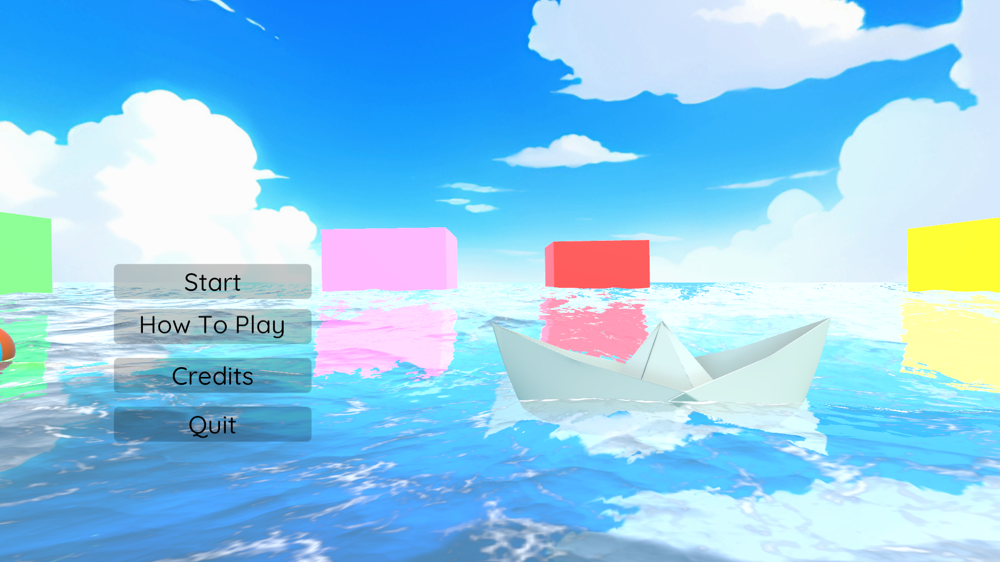
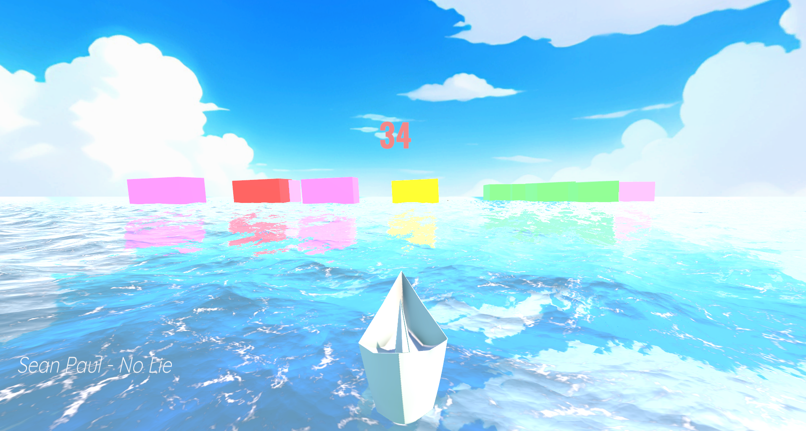
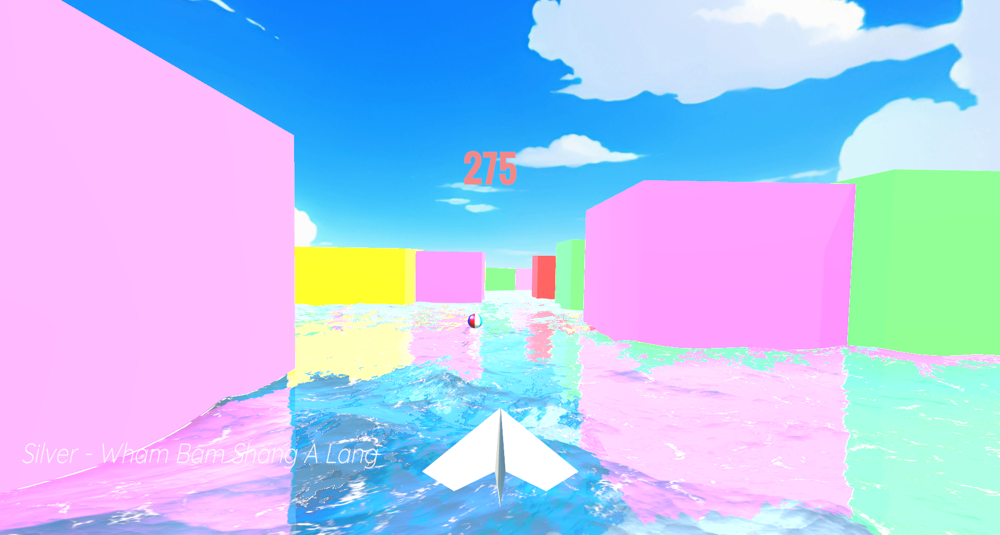

<h1># IITISoC23-Game1-EndlessRunner</h1>

This game contains

-Responsive start menu

-Immense gameplay

-Player switch

-Power-Ups

-Pause menu

-Game over screen

<h1># Team members</h1>

-Pratik Prajn

-Prince Kumar Gupta

<h1># What I learned</h1>

-Learnt C# while developing the game

-Learnt how physics work in games

-Learnt about game design and UI

<h1># How to play?</h1>

-Download the "Game file" folder and enjoy the game

<a href="https://drive.google.com/drive/folders/15CdMUn8GwUsvEi6mPGAxbUpY0HwHeDR2?usp=drive_link" target="_blank">Download here</a>

<h1># Special thanks to</h1>

-Priyanshu Govind Rao (Mentor bhaiya) for guiding our team

-All who made this event possible

<h1># Screenshots</h1>

    

    
    

